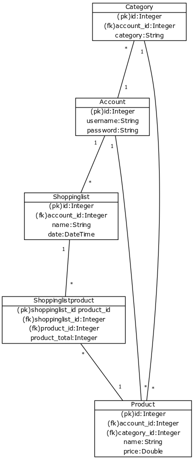

Kuvan tietokantataulut ovat kirjoitettu englanniksi, koska sovelluksessa käytyt taulujen nimet ja attribuutit käyttävät tätä kieltä.

#### Tietokantataulujen kuvaus:

account (käyttäjätili) 

attribuutti | kuvaus | pakollisuus | esimerkki
--- | --- | --- | ---
id | Käyttäjäkohtainen kokonaisluku, joka muodostuu automaattisesti käyttäjän luodessa uuden tilin. Id on myös taulun pääavain | kyllä| 1
username | Minimissään 5 merkkiä ja maksimissaan 50 merkkiä pitkä käyttäjätunnus. Sallitut merkit ovat a-z, A-Z, 0-9. | ei, käytännösä validoinnin takia ei jää tyhjäksi. | HelloWorld85
password | Minimissään 6 ja maksimissaan 30 merkkiä pitkä merkkijono. Sallitut merkit ovat a-z, A-Z, 0-9. Salasana tallenetaan salatussa muodossa. Salasana-sarakkeeseen voidaan talleettaa 150 merkkiä pitkä merkkijono.Tämä siksi, että salasanan tallennus onnistuu myös salattuna. | Ei, käytännössä ei jää tyhjäksi validoinnin takia. | g00dPaSSw0rd
 
category (kategoria)  

attribuutti | kuvaus | pakollisuus | esimerkki
--- | --- | --- | ---
id | Kategoriakohtainen kokonaisluku, joka muodostuu automaattisesti luotaessa uusi kategoria. Id on samalla taulun pääavain| kyllä | 4
category | Kategorian nimi, joka on minimissään 3 ja maksimissaan 100 merkkiä pitkä. Sallitut merkit ovat a-z, A-Z, 0-9, _ sekä välilyönnit sanojen välillä | kyllä | Marjat, Other, Fruits
account_id | Kategorian lisänneen käyttäjän id, joka on myös viiteavain account tauluun. | kyllä | 1
 
shoppinglist (ostoslista)

attribuutti | kuvaus | pakollisuus | esimerkki
--- | --- | --- | ---
id | Ostoslistakohtainen kokonaisluku, joka muodostuu automaattisesti ostoslistaa luodessa. Samalla taulun pääavain. | kyllä | 4
date | Luomishetkellä automaattisesti muodostuva päiväys ja aika UTC-aikaaa | kyllä | 2019-04-20 15:33:11.503838
name | Käyttäjän antaman 3 - 50 merkkiä sisältävä nimi. Sallitut merkit ovat a-z, A-Z, 0-9, _ sekä välilyönnit sanojen välissä. | kyllä | Vaatekauppa, Ruokaostokset
account_id | Ostoslistan lisänneen käyttäjän id ja viiteavain käyttäjätiliin. | kyllä | 1

product (tuote)  

attribuutti | kuvaus | pakollisuus | esimerkki
--- | --- | --- | ---
id | Tuotteen luonnissa automaattisesti muodostuva kokonaisluku ja taulun pääavain | kyllä | 2
name | Minimissään 2 ja maksimissaan 100 merkkiä pitkä merkkijono. Sallitut merkit ovat a-z, A-Z, 0-9, _ sekä välimerkki sanojen välillä. | kyllä | Mustat farkut
price | Desimaaliluku väliltä 0.01 ja 10000.00. Voidaan antaa myös luku ilman desimaaliosaa. | kyllä | 129.59, 13
account_id | Tuotteen luoneen käyttäjän id, joka lisätään automaattisesti. | kyllä | 1
category_id | Tuotteeseen valitun kategorian id, joka lisätään automaattisesti. | kyllä | 2

shoppinglistproduct (ostoslistatuote)  

attribuutti | kuvaus | pakollisuus | esimerkki
--- | --- | --- | ---
shoppinglist_id | Ostoslistan id, johon tuote lisätään. Lisätään automaattisesti. Shoppinglist_id on samanaikaisesti sekä viite- että pääavain. | kyllä | 1
product_id | Tuotteen id, joka lisätään ostoskassiin. Lisäys tapahtuu automaattisesti. Product_id on samanaikaisesti sekä viite- että pääavain. | kyllä | 2
product_total | Käyttäjän antama kokonaisluku, joka ilmentää lisättävän tuotteen määrää ostoslistassa. Määrä voi olla yhden ja sadan väliltä. Jos käyttäjä syöttää luvun 0, niin silloin tuotetta ei lisätä listalle tai olemassaoleva tuote poistetaan listalta. | kyllä | 4

Tauluja ei olla denormalisoitu. Mietin ensin, että olisin lisännyt ostoslistaan sen kokonaishinnan nopeuttamaan hakuja. Luovuin Kuitenkin ajatuksesta, sillä ostoslistan kokonaishinta päivittyy jokaisen tuotteen tai tuotteen poiston yhteydessä. Täällöin pitäisi, joka kerta erikseen tehdä laskenta ja päivittää hinta tietokantaan. Kuitenkin, jos tietokantataulujen koko kasvaa ja tehokkuus kärsii, voitaisiin tätä vaihtoehtoa kokeilla.

Indeksejä ei olla luotu erikseen, mutta ainakin PostreSQL luo pääavaimille indeksit automaattisesti. Tällä hetkellä en näe tarvetta lisätä indeksöintiä muille sarakkeille.  

#### CREATE TABLE -lauseet:

CREATE TABLE account (  
id INTEGER NOT NULL,  
  username VARCHAR(50),  
  password(150),  
  PRIMARY KEY (id)  
);   

CREATE TABLE category (  
  id INTEGER NOT NULL,  
  category VARCHAR(100) NOT NULL,  
  account_id  INTEGER NOT NULL,  
  PRIMARY KEY (id),  
  FOREIGN KEY(account_id) REFERENCES account (id)  
);  
  
CREATE TABLE shoppinglist (
	id INTEGER NOT NULL,  
	date DATETIME NOT NULL,   
	name VARCHAR(50) NOT NULL,   
	account_id INTEGER NOT NULL,  
	PRIMARY KEY (id),  
	FOREIGN KEY(account_id) REFERENCES account (id)  
);

CREATE TABLE product (  
	id INTEGER NOT NULL,  
	name VARCHAR(100) NOT NULL,    
	price NUMERIC(10, 2) NOT NULL,     
	account_id INTEGER NOT NULL,   
	category_id INTEGER NOT NULL,  
	PRIMARY KEY (id),  
	FOREIGN KEY(account_id) REFERENCES account (id),   
	FOREIGN KEY(category_id) REFERENCES category (id)  
);

CREATE TABLE shoppinglistproduct (  
	shoppinglist_id INTEGER NOT NULL,  
	product_id INTEGER NOT NULL,  
	product_total INTEGER NOT NULL,  
	PRIMARY KEY (shoppinglist_id, product_id),  
	FOREIGN KEY(shoppinglist_id) REFERENCES shoppinglist (id),  
	FOREIGN KEY(product_id) REFERENCES product (id)  
);
